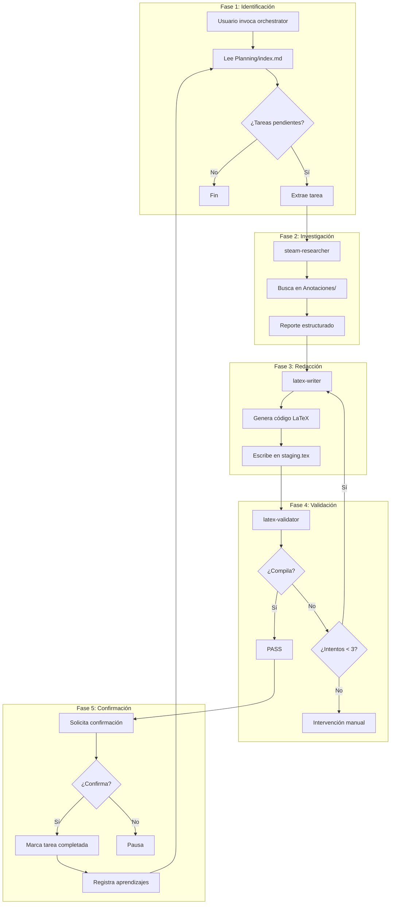

# Práctica de Vapor - Instalaciones II

Universidad de León | Escuela de Ingenierías Industrial, Informática y Aeroespacial  
Grado en Ingeniería Mecánica | Marzo 2026

---

## Descripción del Proyecto

Memoria técnica para el diseño y dimensionamiento de una instalación completa 
de vapor industrial destinada al suministro de energía térmica a una parcela 
industrial.

industrial. 


## Estructura del Repositorio

```
1_Vapor/
├── Practica_Vapor_LaTeX/         # Memoria técnica LaTeX
│   ├── plantilla.tex             # Documento principal
│   ├── staging.tex               # Buffer de código generado
│   ├── preamble.sty              # Preámbulo LaTeX
│   └── Figuras/                  # Imágenes y diagramas
├── Proyecto/
│   ├── Anotaciones/              # Datos técnicos de entrada
│   ├── Especificaciones/         # Criterios de diseño
│   ├── Planificacion/Planning/   # Índice de tareas (checkboxes)
│   ├── .agents/progress.txt      # Registro de aprendizajes
│   └── skills/                   # Skills especializadas
├── Guias_tecnica-herramientas_calculo/  # Manuales técnicos (PDFs)
├── Planos CAD/                   # Planos de la instalación
└── PLAN_ORQUESTACION.md          # Plan de implementación
```

---

## Sistema de Orquestación de Agentes

Este proyecto implementa un sistema de **generación automática de documentación técnica** 
mediante agentes de IA especializados. El flujo de trabajo, denominado "Ralph Loop", 
coordina múltiples agentes para investigar, redactar, validar y registrar contenido LaTeX.

### Arquitectura del "Ralph Loop"



### Agentes del Sistema

| Agente | Rol | Permisos |
|--------|-----|----------|
| **task-orchestrator** | Coordinador central del flujo Ralph Loop | Invoca otros agentes |
| **steam-researcher** | Investigador de datos técnicos de vapor | Solo lectura |
| **latex-writer** | Generador de código LaTeX | Edición de archivos |
| **latex-validator** | Validador de compilación LaTeX | Ejecución pdflatex |

### Skills Especializadas

| Skill | Función |
|-------|---------|
| `latex_drafting_skill` | Genera fragmentos LaTeX compatibles con plantilla.tex |
| `steam_knowledge_skill` | Extrae datos técnicos de Anotaciones y manuales |
| `doc_tecnica_vapor` | Acceso a PDFs técnicos (Spirax Sarco, IDAE, Vitomax) |

### Archivos Clave del Sistema

| Archivo | Función |
|---------|---------|
| `Proyecto/Planificacion/Planning/index.md` | Lista de tareas con checkboxes `[ ]` / `[x]` |
| `Proyecto/.agents/progress.txt` | Registro de aprendizajes por sesión |
| `Practica_Vapor_LaTeX/staging.tex` | Buffer de código LaTeX generado |
| `Practica_Vapor_LaTeX/plantilla.tex` | Documento principal de la memoria |

---

## Uso del Sistema

### Iniciar la orquestación

```bash
# Procesar siguiente tarea pendiente
@task-orchestrator procesa la siguiente tarea pendiente

# Procesar tarea específica
@task-orchestrator procesa la tarea 2.3.4

# Modo continuo
@task-orchestrator procesa todas las tareas pendientes
```

### Invocación manual de agentes

```bash
@steam-researcher investiga la sección 2.4.1
@latex-writer genera código para sección 2.3.5
@latex-validator valida staging.tex
```

---

## Requisitos

- **pdflatex** o **lualatex** en PATH del sistema
- **IDE con soporte para agentes de IA** (Claude, GPT, Codex, etc.)
- Paquetes LaTeX: `booktabs`, `graphicx`, `amsmath`, `float`, `siunitx`, `hyperref`

---

## Refinamientos del Sistema

El sistema ha evolucionado para mejorar el tratamiento de datos técnicos mediante los siguientes refinamientos:

### Procesamiento en Lote Continuo
Los tareas relacionadas se procesan automáticamente sin intervención manual repetida. Esto permite que el flujo Ralph Loop procese secciones completas (ej: todos los tramos de una red) manteniendo coherencia contextual entre generaciones.

### Gestión de Dependencias entre Agentes
El sistema ahora identifica y resuelve dependencias lógicas entre agentes. Por ejemplo, el agente `latex-writer` requiere que `steam-researcher` haya completado la investigación correspondiente antes de generar código.

### Validación con Retroalimentación
Se implementó un sistema de puntuación en la validación LaTeX que proporciona retroalimentación cuantitativa al agente escritor. Esto permite al sistemaauto-corregir errores de formato o estructura antes de solicitar confirmación al usuario.

### Estructura Dinámica de Preámbulo
El preamble.sty se adapta dinámicamente según los requerimientos del contenido generado. Paquetes como `booktabs` se añaden automáticamente cuando el contenido incluye tablas complejas.

### Detección de Modo de Operación
El sistema distingue entre invocation única (una tarea) y procesamiento continuo (múltiples tareas relacionadas), ajustando el flujo de trabajo para optimizar el tratamiento de datos en cada modo.
